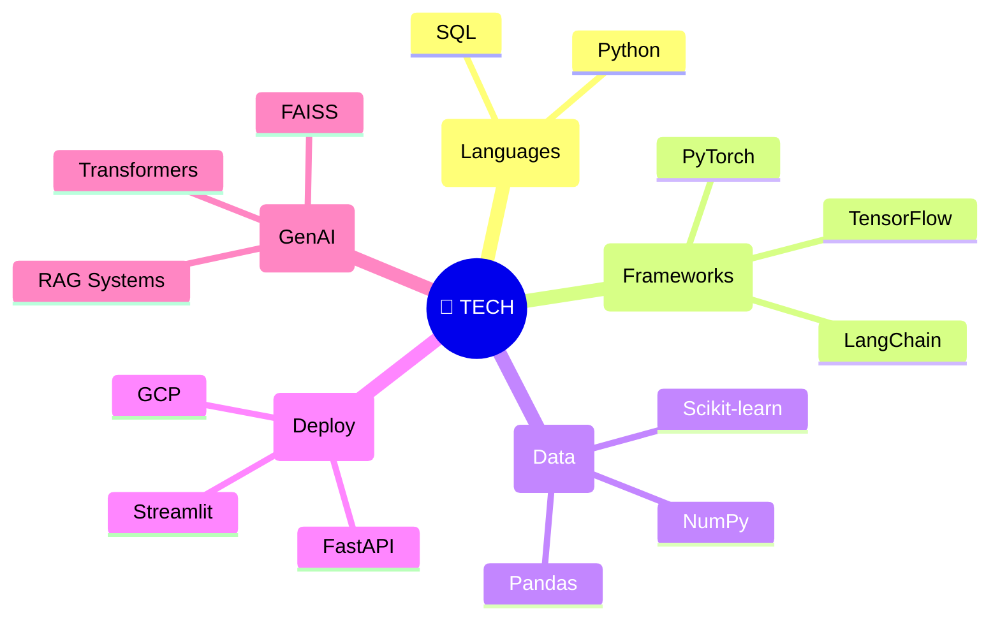
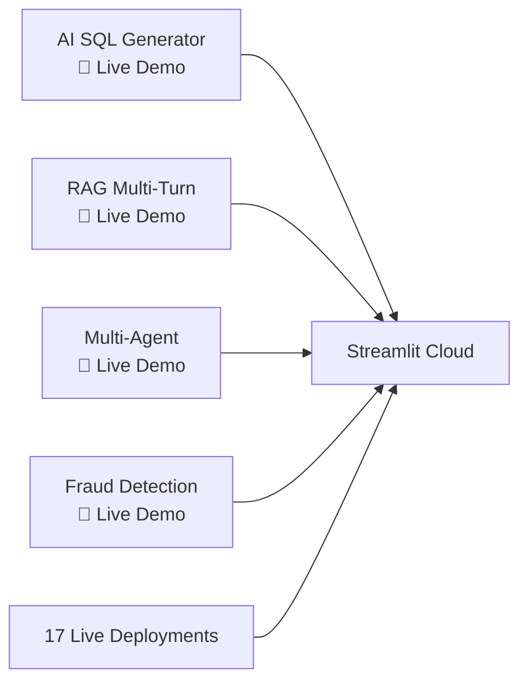

<p align="center">
<div style="position: relative; overflow: hidden; border-radius: 20px; padding: 40px; background: linear-gradient(145deg, #0a0a0a 0%, #1a1a2e 50%, #16213e 100%); box-shadow: 0 25px 50px rgba(0,0,0,0.5); border: 1px solid rgba(255,107,107,0.2);">

<div style="position: absolute; top: 0; left: 0; right: 0; bottom: 0; background: 
  radial-gradient(circle at 20% 80%, rgba(120,119,198,0.3) 0%, transparent 50%),
  radial-gradient(circle at 80% 20%, rgba(255,119,198,0.3) 0%, transparent 50%),
  radial-gradient(circle at 40% 40%, rgba(120,219,255,0.2) 0%, transparent 50%);
  animation: shimmer 6s ease-in-out infinite;"></div>

<div style="position: relative; z-index: 2; text-align: center;">

<h1 style="background: linear-gradient(-45deg, #FF6B6B, #4ECDC4, #45B7D1, #FECA57); 
            background-size: 400% 400%; 
            -webkit-background-clip: text; 
            -webkit-text-fill-color: transparent; 
            background-clip: text;
            animation: gradientShift 4s ease infinite, float 6s ease-in-out infinite;
            font-size: 3.5rem; font-weight: 900; margin: 0; letter-spacing: -2px;">
DARSHAN KURALI
</h1>

<div style="background: rgba(255,255,255,0.1); backdrop-filter: blur(20px); border-radius: 50px; 
            padding: 15px 40px; border: 1px solid rgba(255,255,255,0.2); 
            display: inline-block; margin: 20px 0; box-shadow: 0 8px 32px rgba(0,0,0,0.3);">
<span style="color: #FF6B6B; font-size: 1.3rem; font-weight: 700;">AI & Data Science Engineer</span> 
<span style="color: #fff; font-size: 1.1rem; margin: 0 20px;">•</span>
<span style="color: #4ECDC4;">17 Projects</span>
<span style="color: #fff; font-size: 1.1rem; margin: 0 20px;">•</span>
<span style="color: #45B7D1;">95%+ Accuracy</span>
</div>

</div>

<style>
@keyframes shimmer { 0%, 100% { transform: translateX(-100%); } 50% { transform: translateX(100%); } }
@keyframes gradientShift { 0%, 100% { background-position: 0% 50%; } 50% { background-position: 100% 50%; } }
@keyframes float { 0%, 100% { transform: translateY(0px); } 50% { transform: translateY(-10px); } }
</style>

</div>
</p>

---

## 🌌 **Technical Universe**



---

## 🔥 **17 Production Systems Portfolio**

<p align="center">
<table style="background: rgba(15,15,25,0.8); border-radius: 20px; border-spacing: 0; overflow: hidden; 
              box-shadow: 0 20px 40px rgba(0,0,0,0.4); border: 1px solid rgba(255,107,107,0.2);">
  
<tr style="background: linear-gradient(90deg, #FF6B6B, #4ECDC4); color: white; font-weight: 700;">
  <th style="padding: 20px; text-align: left;">🏆 PROJECT</th>
  <th style="padding: 20px; text-align: left;">📊 METRIC</th>
  <th style="padding: 20px; text-align: left;">🛠️ TECH</th>
</tr>

<tr style="border-bottom: 1px solid rgba(255,255,255,0.1);">
  <td style="padding: 20px; font-weight: 700; color: #FF6B6B;">🥇 AI SQL Generator</td>
  <td style="padding: 20px; color: #4ECDC4;"><strong>95% Accuracy</strong><br>3x DB Support</td>
  <td style="padding: 20px; color: #45B7D1;">Streamlit • LangChain • OpenAI</td>
</tr>

<tr style="background: rgba(255,255,255,0.02); border-bottom: 1px solid rgba(255,255,255,0.1);">
  <td style="padding: 20px; font-weight: 700; color: #FF6B6B;">🥈 Advanced RAG</td>
  <td style="padding: 20px; color: #4ECDC4;"><strong>&lt;5% Hallucination</strong><br>8+ Turn Memory</td>
  <td style="padding: 20px; color: #45B7D1;">FAISS • Gemini Pro • Tavily</td>
</tr>

<tr style="border-bottom: 1px solid rgba(255,255,255,0.1);">
  <td style="padding: 20px; font-weight: 700; color: #4ECDC4;">🥉 Multi-Agent</td>
  <td style="padding: 20px; color: #FF6B6B;"><strong>40% Faster</strong><br>10+ Agents</td>
  <td style="padding: 20px; color: #45B7D1;">LangGraph • Tool Calling</td>
</tr>

<tr style="background: rgba(255,255,255,0.02); border-bottom: 1px solid rgba(255,255,255,0.1);">
  <td style="padding: 20px; font-weight: 600; color: #45B7D1;">Fraud Detection</td>
  <td style="padding: 20px; color: #FF6B6B;"><strong>96% ROC-AUC</strong></td>
  <td style="padding: 20px; color: #4ECDC4;">XGBoost • Isolation Forest</td>
</tr>

<tr style="border-bottom: 1px solid rgba(255,255,255,0.1);">
  <td style="padding: 20px; font-weight: 600; color: #45B7D1;">NLP Chatbot</td>
  <td style="padding: 20px; color: #4ECDC4;"><strong>89% Accuracy</strong></td>
  <td style="padding: 20px; color: #FF6B6B;">Transformers • RAG</td>
</tr>

<tr style="background: rgba(255,255,255,0.02);">
  <td style="padding: 20px; font-weight: 600; color: #45B7D1;">CV Inspection</td>
  <td style="padding: 20px; color: #FF6B6B;"><strong>96% CNN Accuracy</strong></td>
  <td style="padding: 20px; color: #4ECDC4;">TensorFlow • OpenCV</td>
</tr>

</table>
</p>

> **📈 Complete Portfolio: 17 Deployed Systems** • **⭐ 95%+ Benchmarks** • **⚡ Production Ready**

---

## 🎯 **Achievement Matrix**

```mermaid
xychart-beta
    x-scale-band ::::15px
    y-scale-linear ::::1
    title "Darshan Kurali - Elite Performance"
    x-axis [ "Projects" "Accuracy" "Deployments" "LLM" "DB Support" ]
    y-axis "Count / %" 0 --> 100
    bar[1][2]
    bar[2][3][4]
```

---

## 🎓 **Academic Excellence**

<div align="center" style="background: linear-gradient(135deg, rgba(15,15,25,0.9), rgba(25,25,45,0.9)); 
                          border-radius: 25px; padding: 40px; margin: 40px 0; 
                          border: 1px solid rgba(255,107,107,0.3);">

<table style="color: white; width: 100%; border-collapse: collapse;">
<tr>
  <td style="padding: 25px; vertical-align: top; width: 33%;">
    <div style="font-size: 1.5rem; color: #FF6B6B; margin-bottom: 15px;">🎓 Education</div>
    <div style="font-weight: 700; font-size: 1.2rem;">B.E. AI & Data Science</div>
    <div>KLE College of Engineering</div>
    <div style="color: #4ECDC4; font-weight: 700; font-size: 1.3rem;">CGPA: 8.52/10</div>
    <div style="color: #888; font-size: 0.9rem;">2022-2026</div>
  </td>
  
  <td style="padding: 25px; vertical-align: top; width: 33%;">
    <div style="font-size: 1.5rem; color: #4ECDC4; margin-bottom: 15px;">💼 Experience</div>
    <div style="font-weight: 700; font-size: 1.2rem;">Data Science Intern</div>
    <div>Prinston Smart Engineers</div>
    <div style="color: #FF6B6B; font-size: 0.9rem;">Feb-May 2026</div>
    <div style="color: #45B7D1;">• ML Deployment • Pipelines</div>
  </td>
  
  <td style="padding: 25px; vertical-align: top; width: 33%;">
    <div style="font-size: 1.5rem; color: #45B7D1; margin-bottom: 15px;">🏅 Certifications</div>
    <div style="font-weight: 700;">6 Professional</div>
    <div style="color: #FF6B6B;">• Andrew Ng ML</div>
    <div style="color: #4ECDC4;">• PyTorch DL</div>
    <div style="color: #FFEAA7;">• IBM AI/ML</div>
  </td>
</tr>
</table>

</div>

---

## 🚀 **Live Demo Gallery**



---

## 💼 **Open for Collaboration**

<p align="center" style="background: linear-gradient(135deg, #FF6B6B22, #4ECDC422); 
                        border-radius: 25px; padding: 40px; margin: 40px 0;
                        border: 2px solid transparent;
                        background-clip: padding-box;
                        position: relative;
                        overflow: hidden;">
<div style="position: absolute; top: 0; left: 0; right: 0; bottom: 0; 
            background: linear-gradient(45deg, transparent 30%, rgba(255,255,255,0.1) 50%, transparent 70%); 
            animation: shine 3s infinite;"></div>

<div style="position: relative; z-index: 1;">
<h2 style="color: #FF6B6B; font-size: 2.5rem; margin-bottom: 20px; font-weight: 900;">
Ready for Production AI Roles
</h2>

<div style="display: flex; gap: 20px; justify-content: center; flex-wrap: wrap;">
<a href="https://linkedin.com/in/darshan-kurali" style="background: linear-gradient(45deg, #0077B5, #00A0DC); 
                                                    color: white; padding: 15px 30px; border-radius: 50px; 
                                                    text-decoration: none; font-weight: 700; 
                                                    box-shadow: 0 10px 30px rgba(0,119,181,0.4);">
  💼 LinkedIn
</a>

<a href="mailto:kuralidarshan@gmail.com" style="background: linear-gradient(45deg, #EA4335, #FF6B6B); 
                                               color: white; padding: 15px 30px; border-radius: 50px; 
                                               text-decoration: none; font-weight: 700; 
                                               box-shadow: 0 10px 30px rgba(234,67,53,0.4);">
  ✉️ Email Me
</a>

<a href="https://github.com/darshankurali" style="background: linear-gradient(45deg, #181717, #333); 
                                                 color: white; padding: 15px 30px; border-radius: 50px; 
                                                 text-decoration: none; font-weight: 700; 
                                                 box-shadow: 0 10px 30px rgba(24,23,23,0.4);">
  🐙 GitHub
</a>

<a href="https://darshan-kurali-portfolio.com" style="background: linear-gradient(45deg, #FF6B6B, #4ECDC4); 
                                                     color: white; padding: 15px 30px; border-radius: 50px; 
                                                     text-decoration: none; font-weight: 700; 
                                                     box-shadow: 0 10px 30px rgba(255,107,107,0.4);">
  🌐 Portfolio
</a>
</div>

<div style="margin-top: 30px; color: #888; font-style: italic;">
"Building the future of AI, one production system at a time."
</div>
</p>

<style>
@keyframes shine {
  0% { transform: translateX(-100%) translateY(-100%) rotate(45deg); }
  100% { transform: translateX(100%) translateY(100%) rotate(45deg); }
}
</style>

<div align="center" style="color: #888; margin-top: 60px; font-size: 0.9rem;">
⭐ **April 2026** | **17 Production Projects** | **Actively Hiring**
</div>
